# 一、Ajax入门


## 1. Ajax概念和axios使用


### 1.1 什么是 AJAX


**定义：**

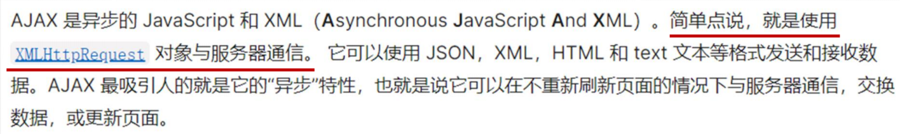


**概念：**

AJAX 是浏览器与服务器进行数据通信的技术

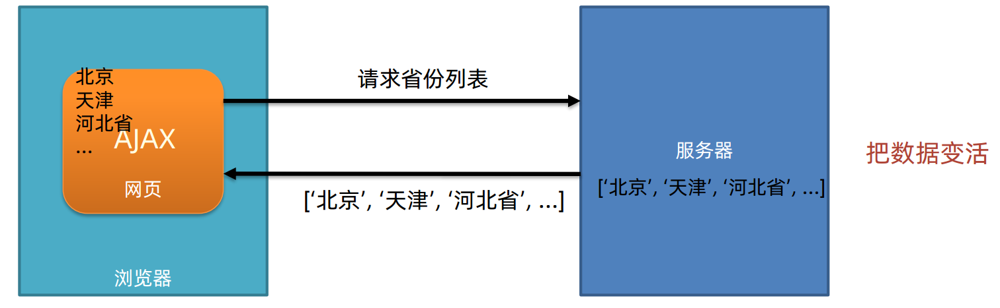


### 1.2 怎么用 AJAX ？


1. 先使用 axios 库，与服务器进行<font color='red'>数据通信</font>
  - 基于 XMLHttpRequest 封装、代码简单、月下载量在 14 亿次
  - <font color='red'>Vue、React 项目中都会用到 axios</font> 
2. 再学习 XMLHttpRequest 对象的使用，了解 AJAX 底层原理


### 1.3 axios 使用


**语法：**

1. 引入 axios.js：https://cdn.jsdelivr.net/npm/axios/dist/axios.min.js
2. 使用 axios 函数
  - 传入<font color='red'>配置对象</font>
  - 再用<font color='red'> .then</font> 回调函数接收结果，并做后续处理

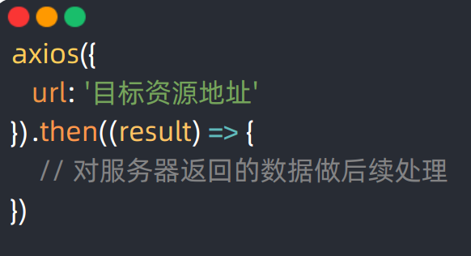

**示例：**

需求：请求目标资源地址，拿到省份列表数据，显示到页面

目标资源地址：http://hmajax.itheima.net/api/province

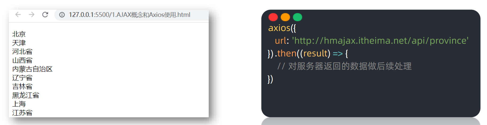


## 2. 认识 URL


原因：知道作用和组成，方便与后端人员沟通

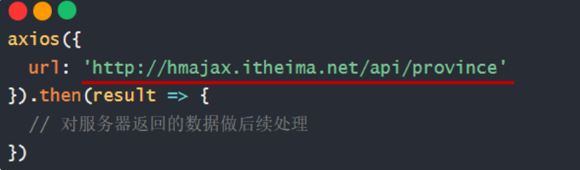

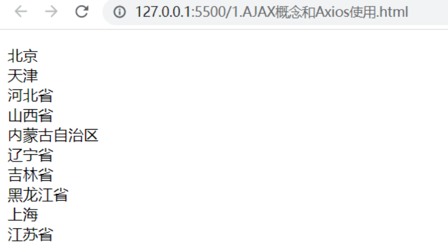


### 2.1 什么是 URL？


**定义：**

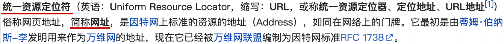

**例如：**

- https://www.baidu.com/index.html	              →网页资源

- https://www.itheima.com/images/logo.png          →图片资源

- http://hmajax.itheima.net/api/province                →数据资源

	

	概念：URL 就是<font color='red'>统一资源定位符</font>，简称<font color='red'>网址</font>，用于访问网络上的<font color='red'>资源</font>

	

### 2.2 URL 的组成


**组成：**

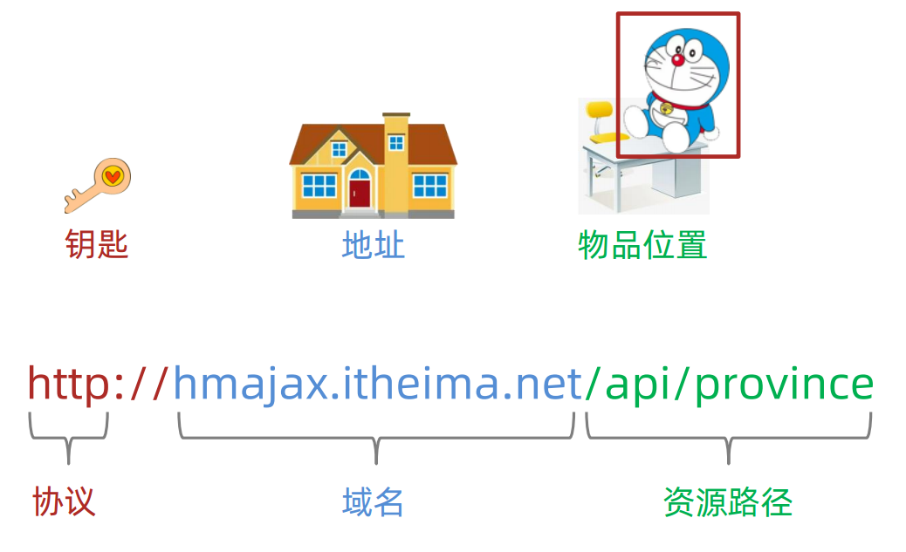

**<font color='red'>协议</font>**

**http 协议：**超文本传输协议，规定浏览器和服务器之间传输数据的<font color='red'>格式</font>

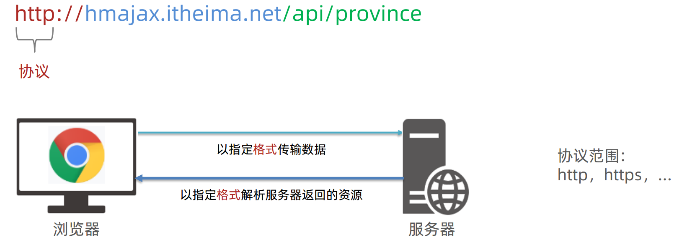


**<font color='#5e9ede'>域名</font>**

**域名：**标记服务器在互联网中<font color='red'>方位</font>

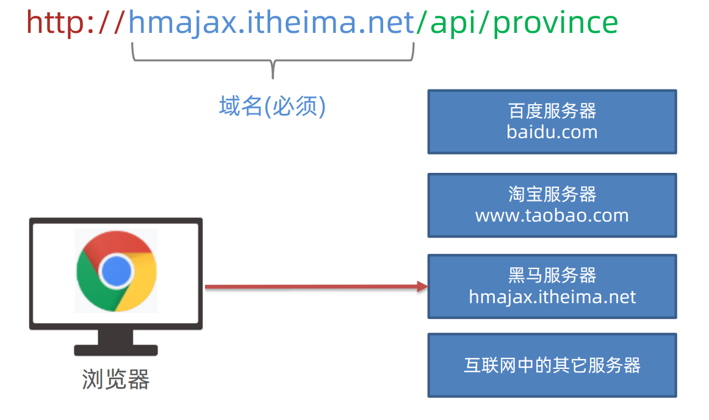

<font color='#01b154'>**资源路径**</font>

**资源路径：**标记资源在服务器下的<font color='red'>具体位置</font>

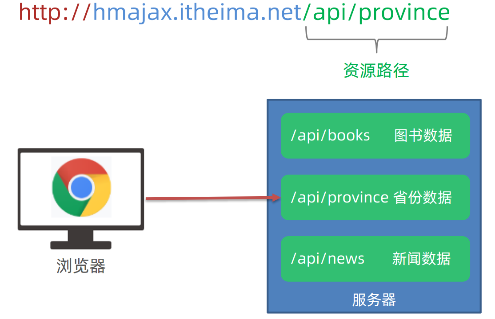


### 2.3 示例


获取 - 新闻列表

**需求：**使用 axios 从服务器拿到新闻列表数据
目标资源地址：http://hmajax.itheima.net/api/news


## 3. URL 查询参数


**定义**：浏览器提供给服务器的<font color='red'>额外信息</font>，让服务器返回浏览器想要的数据

**语法**：http://xxxx.com/xxx/xxx?参数名1=值1&参数名2=值2

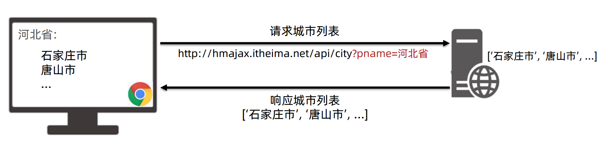


### 3.1 axios－查询参数


**语法**：使用 axios 提供的 <font color='red'>params </font>选项

**注意**：axios 在运行时把参数名和值，会拼接到 url<font color='red'>?参数名=值</font>

**城市列表**：http://hmajax.itheima.net/api/city?pname=河北省

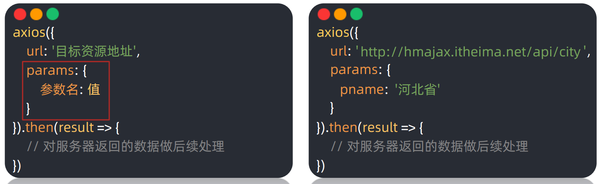


## 4. 常用请求方法和数据提交


### 4.1 请求方法


对服务器<font color='red'>资源</font>，要执行的<font color='red'>操作</font>

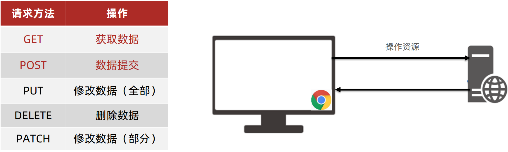


### 4.2 数据提交


**场景：**当数据需要在服务器上<font color='red'>保存</font>

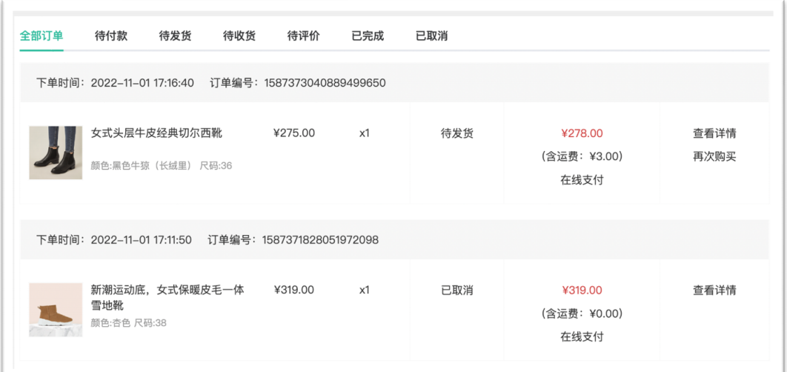

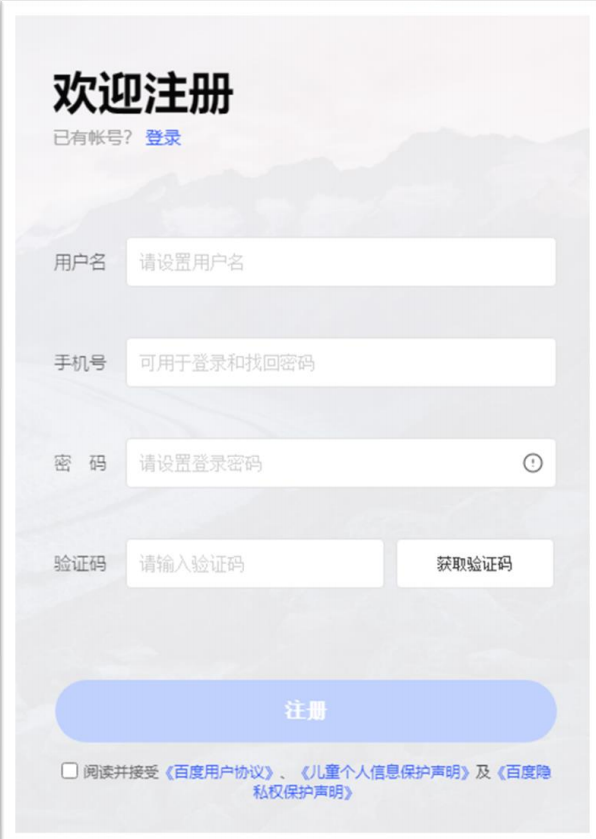


### 4.3 axios 请求配置


**url：**请求的 URL 网址

**<font color='red'>method</font>：**请求的方法，<font color='red'>GET</font>可以省略（不区分大小写）

**<font color='red'>data</font>**：提交数据

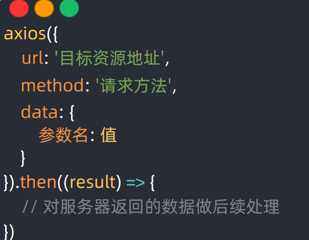


### 4.4 数据提交－注册账号


**需求：**通过 axios 提交用户名和密码，完成注册功能

注册用户 URL 地址：http://hmajax.itheima.net/api/register

**请求方法**：<font color='red'>POST</font>

**参数名：**

<font color='red'>username</font> 用户名（中英文和数字组成，最少 8 位）
<font color='red'>password</font> 密码（最少 6 位）

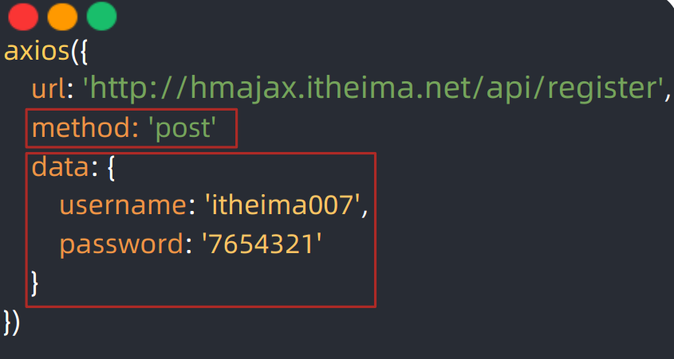

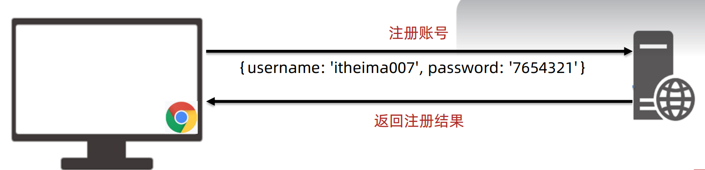


### 4.6 axios 的核心配置


➢ url：请求 URL 网址
➢ <font color='red'>method</font>：请求方法，<font color='red'>GET</font> 可以省略（不区分大小写）
➢ params：查询参数
➢ <font color='red'>data</font>：提交数据

从服务器中查询数据：

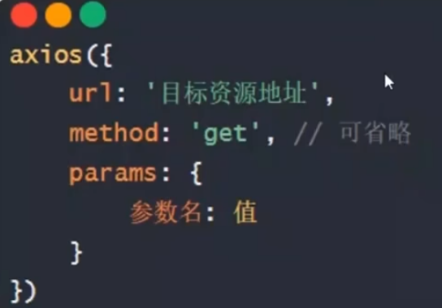

提交数据到服务器中：

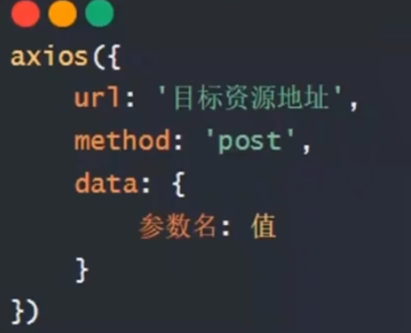


### 4.7 axios 错误处理


**场景：**再次注册相同的账号，会遇到报错信息

**处理：**用更直观的方式，给<font color='red'>普通用户</font>展示错误信息

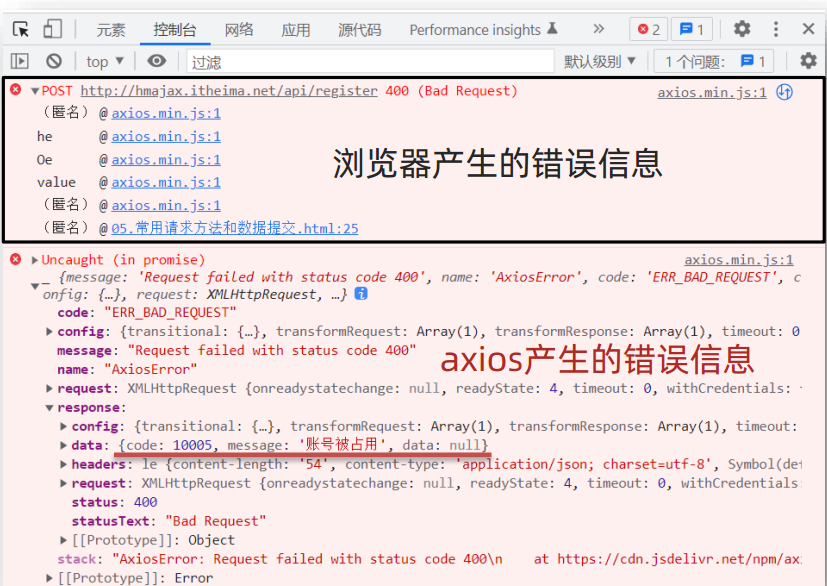

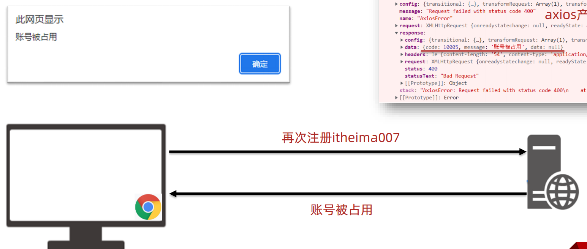


**语法：**在 <font color='red'>then</font> 方法的后面，通过点语法调用 <font color='red'>catch</font> 方法，传入<font color='red'>回调函数</font>并定义<font color='red'>形参</font>

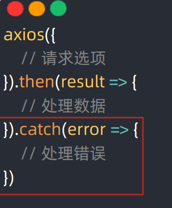

**处理**：注册案例，重复注册时通过弹框提示用户错误原因


## 5. HTTP协议-报文


**HTTP 协议：**规定了浏览器发送及服务器返回内容的<font color='red'>格式</font>


### 5.1 请求报文


**<font color='red'>请求报文</font>：**浏览器按照 HTTP 协议要求的<font color='red'>格式</font>，发送给服务器的<font color='red'>内容</font>

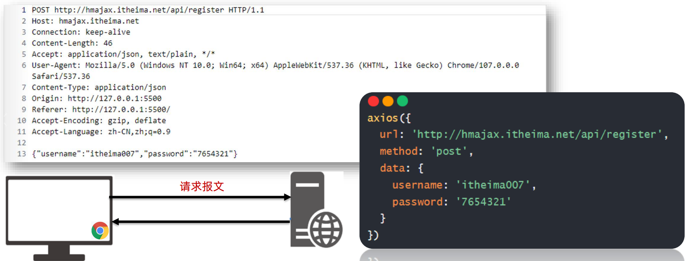


#### 1.请求报文的格式


请求报文的组成部分有:
1. <font color='red'>请求行：请求方法，URL，</font>协议
2. <font color='red'>请求头：</font>以键值对的格式携带的附加信息，比如：<font color='red'>Content-Type</font>
3. 空行：分隔请求头，空行之后的是发送给服务器的资源
4. <font color='red'>请求体：发送的资源</font>

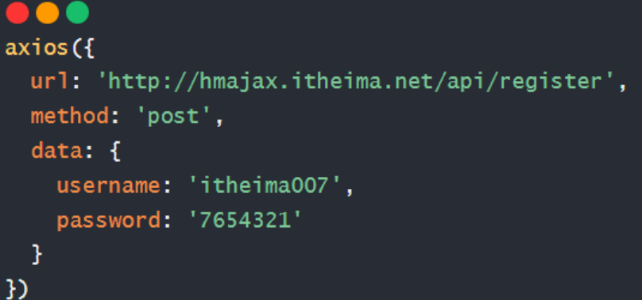

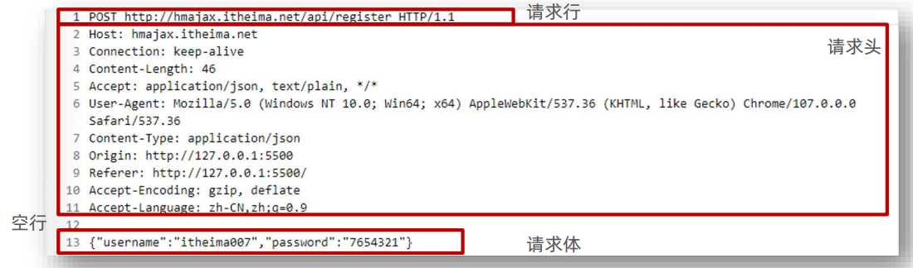

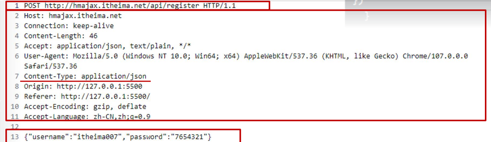


通过 Chrome 的<font color='red'>网络面板</font>查看请求报文

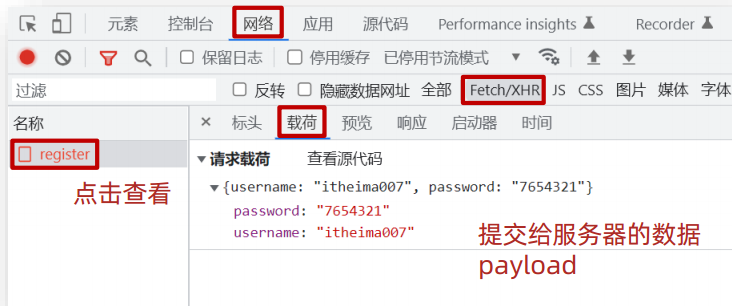


#### 2. 请求报文－错误排查


需求：通过请求报文排查错误原因，并修复

输入<font color='red'>正确</font>的用户名和密码无法登录

• 用户名：<font color='red'>itheima007</font>
• 密码：<font color='red'>7654321</font>


### 5.2 响应报文


<font color='red'>**响应报文**</font>：服务器按照 HTTP 协议要求的<font color='red'>格式</font>，返回给浏览器的<font color='red'>内容</font>

1. <font color='red'>响应行（状态行）</font>：协议、<font color='red'>HTTP 响应状态码</font>、状态信息
2. <font color='red'>响应头</font>：以键值对的格式携带的附加信息，比如：<font color='red'>Content-Type</font>
3. 空行：分隔响应头，空行之后的是服务器返回的资源
4. <font color='red'>响应体：返回的资源</font>

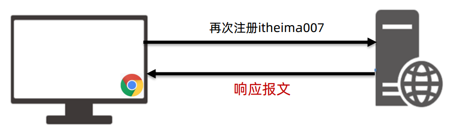

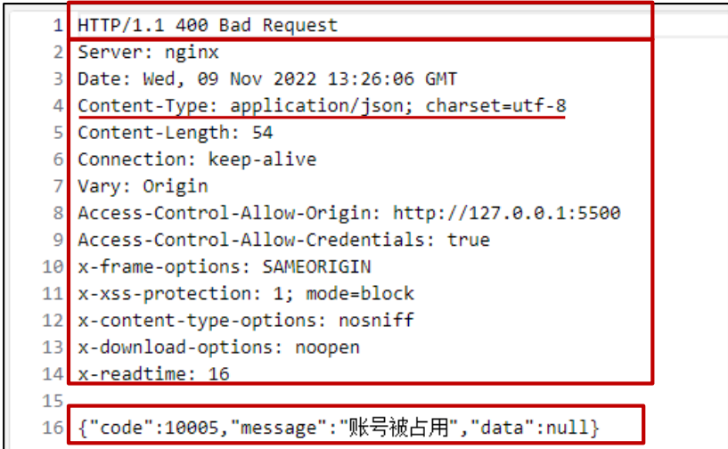


#### 1. HTTP 响应状态码


HTTP 响应状态码：用来表明请求<font color='red'>是否成功</font>完成

比如：<font color='red'>404（服务器找不到资源）</font>

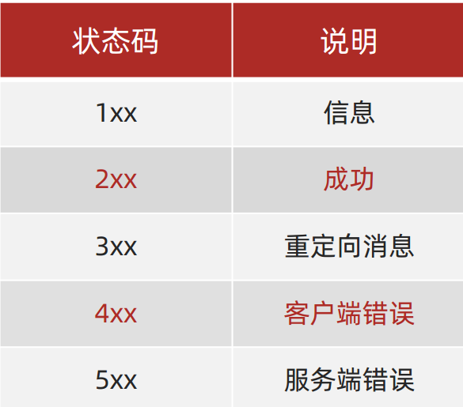


## 6. 接口文档


<font color='red'>接口文档：</font>描述<font color='red'>接口</font>的文章<font color='red'>（后端工程师）</font>

<font color='red'>接口：</font>使用 AJAX 和服务器通讯时，使用的 <font color='red'>URL，请求方法，以及参数</font>

<font color='red'>传送门：</font>AJAX 阶段接口文档https://apifox.com/apidoc/shared/1b0dd84f-faa8-435d-b355-5a8a329e34a8)

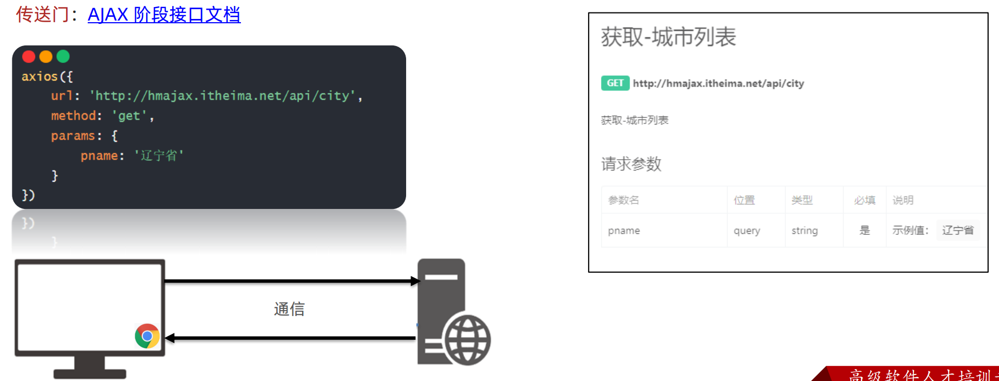


## 7. 案例 - 用户登录


1. 点击登录时，判断用户名和密码长度
2. 提交数据和服务器通信
3. 提示信息

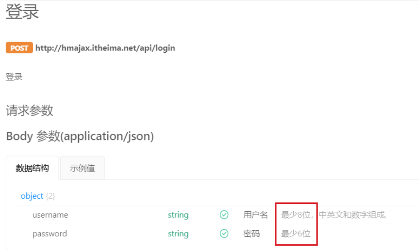

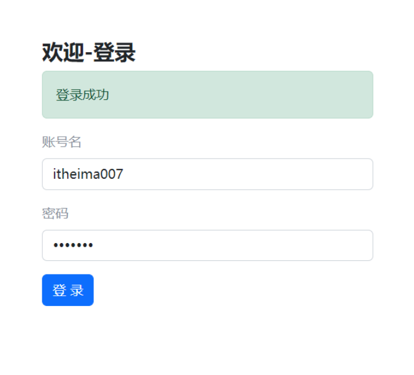

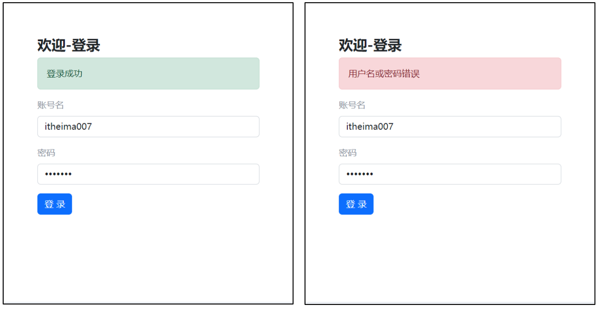


## 8. form-serialize 插件


**作用：**<font color='red'>快速</font>收集表单元素的值

插件js文件存储在C:\Users\Lenovo\Desktop\课程实践\Vue框架前置课\Ajax\day01\lib中

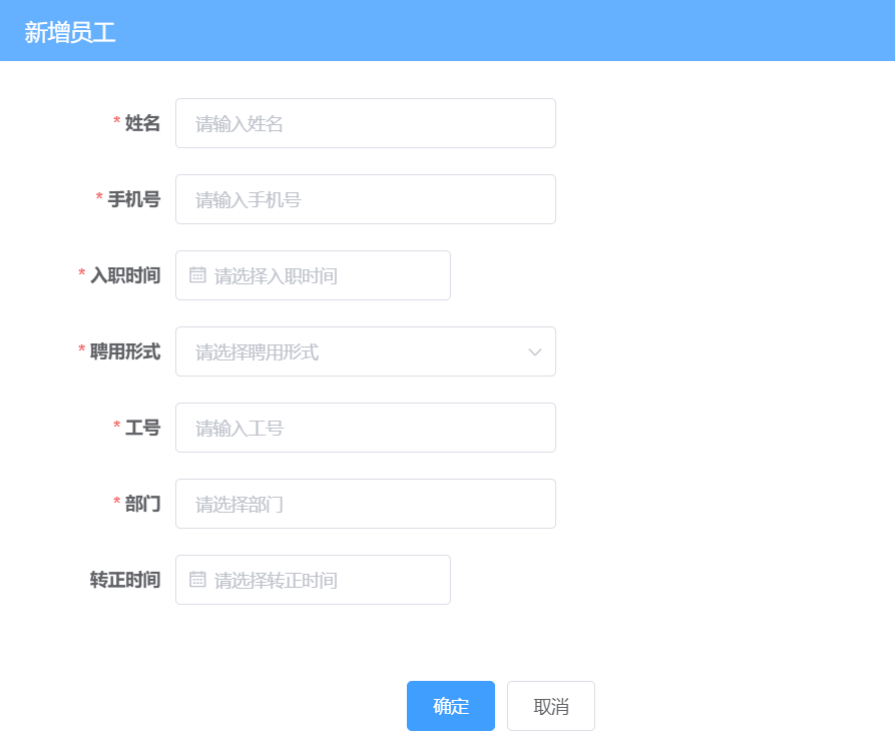

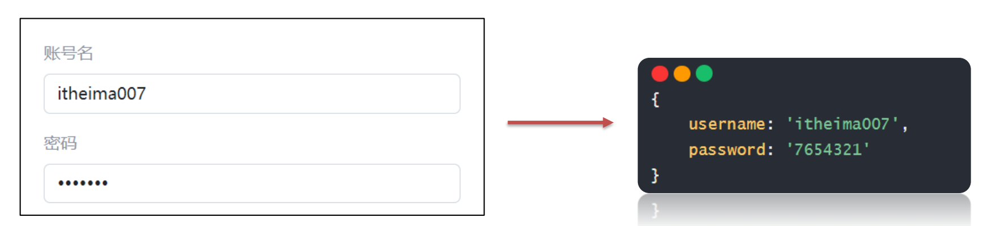

**语法：**

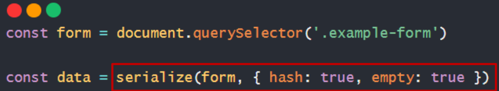

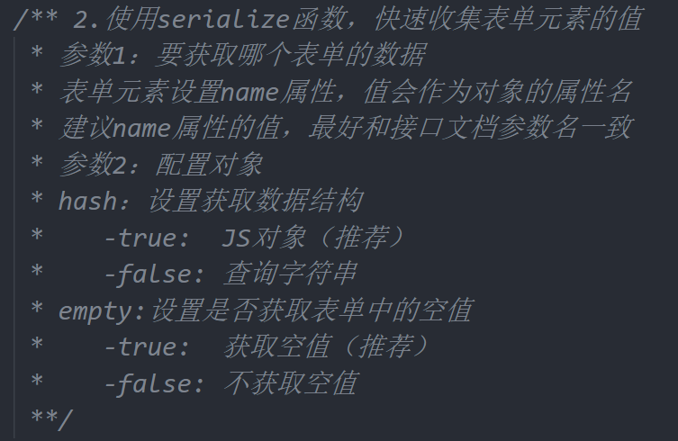

**hash值为true时：**结果为JS对象<font color='red'>（更推荐）</font>

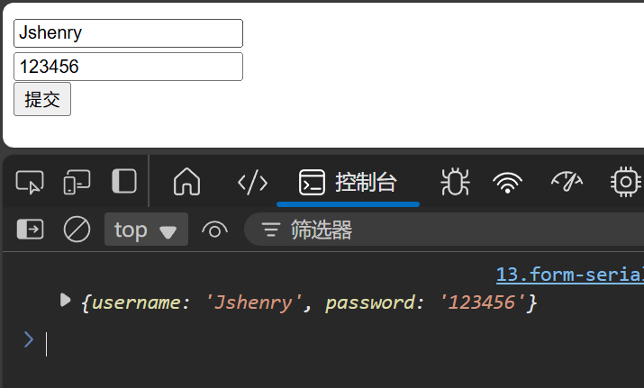

**hash值为false时：**结果为查询字符串

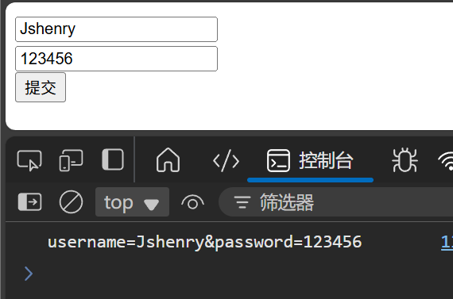

**empty值为true时：**获取空值<font color='red'>（更推荐）</font>

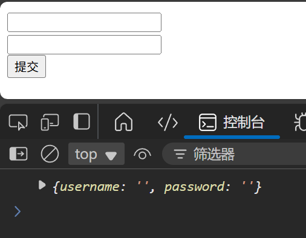

**empty值为false时：**不获取空值

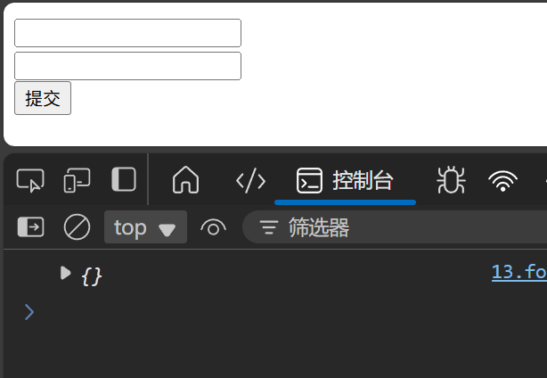


### 8.1 案例－用户登录


使用 form-serialize 插件，<font color='red'>收集</font>用户名和密码

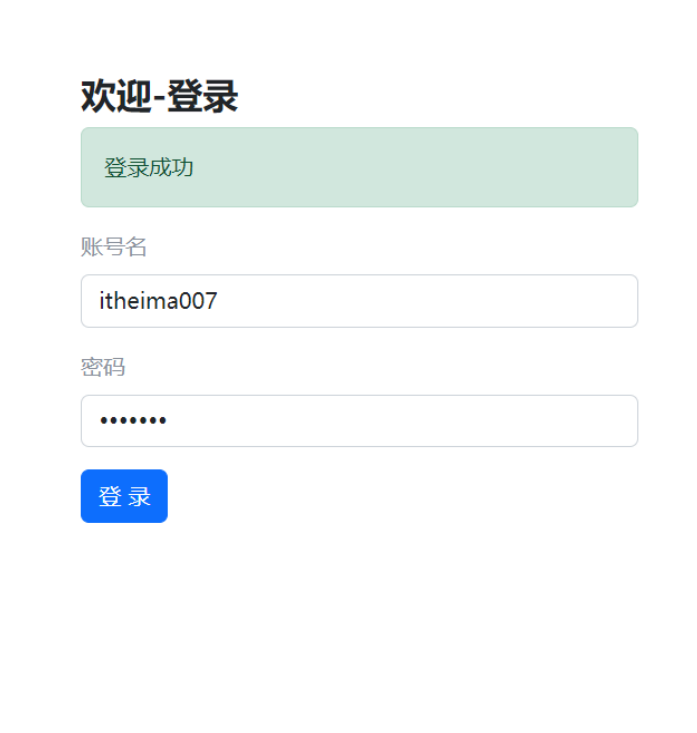


# 二、Ajax综合案例


## 1. 案例-图书管理


步骤：
1. Bootstrap 弹框
2. 渲染列表（查）
3. 新增图书（增）
4. 删除图书（删）
5. 编辑图书（改）

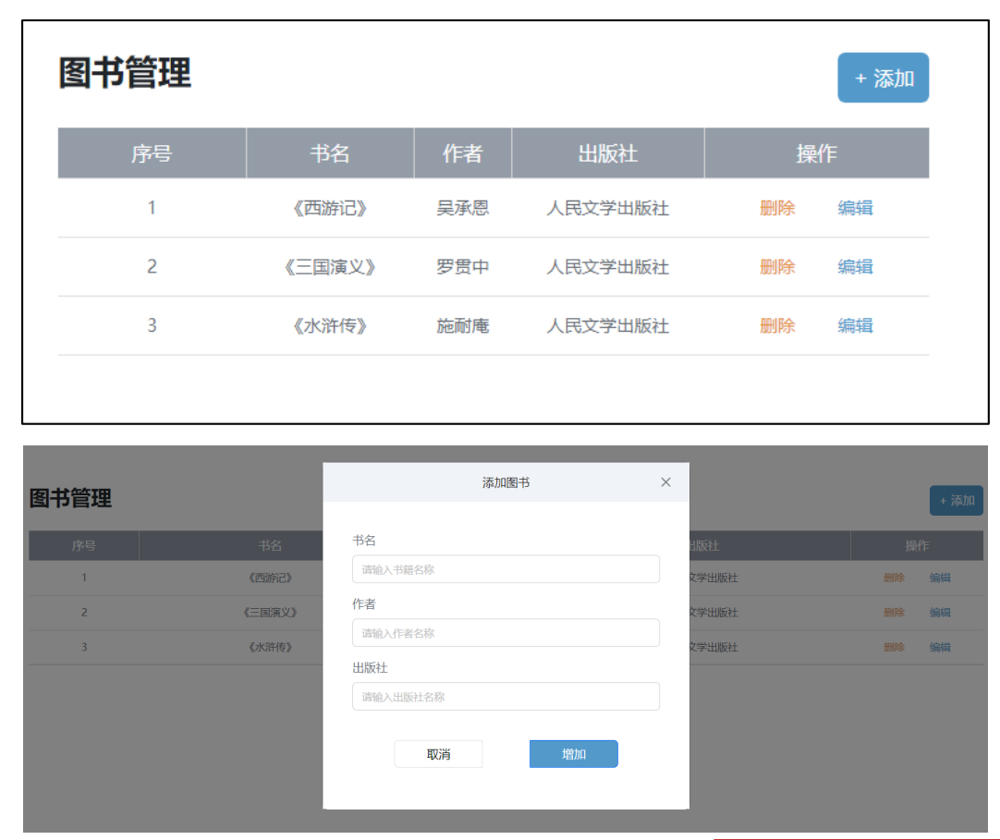


### 1.1 Bootstrap 弹框


功能：不离开当前页面，显示单独内容，供用户操作

bootstarp官网：[Bootstrap中文网](https://www.bootcss.com/)

步骤：

1. 引入 bootstrap.css 和 bootstrap.js

```html
<!-- 引入bootstrap.css -->
  <link href="https://cdn.jsdelivr.net/npm/bootstrap@5.2.2/dist/css/bootstrap.min.css" rel="stylesheet">
<!-- 引入bootstrap.js -->
  <script src="https://cdn.jsdelivr.net/npm/bootstrap@5.2.2/dist/js/bootstrap.min.js"></script>
```

2. 准备<font color='red'>弹框标签</font>，确认结构

3. 通过<font color='red'>自定义属性</font>(data-bs-toggle,data-bs-target,data-bs-dismiss)，控制弹框的<font color='red'>显示</font>和<font color='red'>隐藏</font>


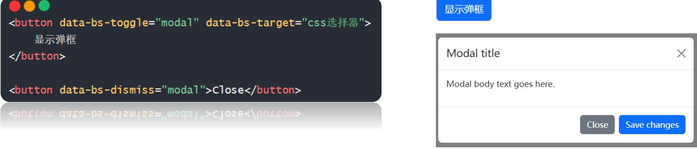

1. 通过属性控制，弹框显示或隐藏		*单纯显示/隐藏*	如上左图
2. 通过 JS 控制，弹框显示或隐藏	         *额外逻辑代码*	 如下右图


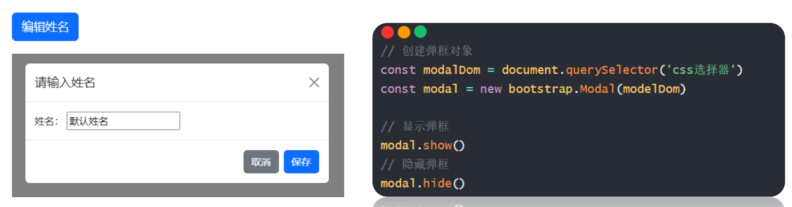


### 1.2 图书管理 - 渲染列表


自己的图书数据：给自己起个<font color='red'>外号</font>，并告诉服务器，默认会有三本书，基于这三本书做数据的<font color='red'>增删改查</font>

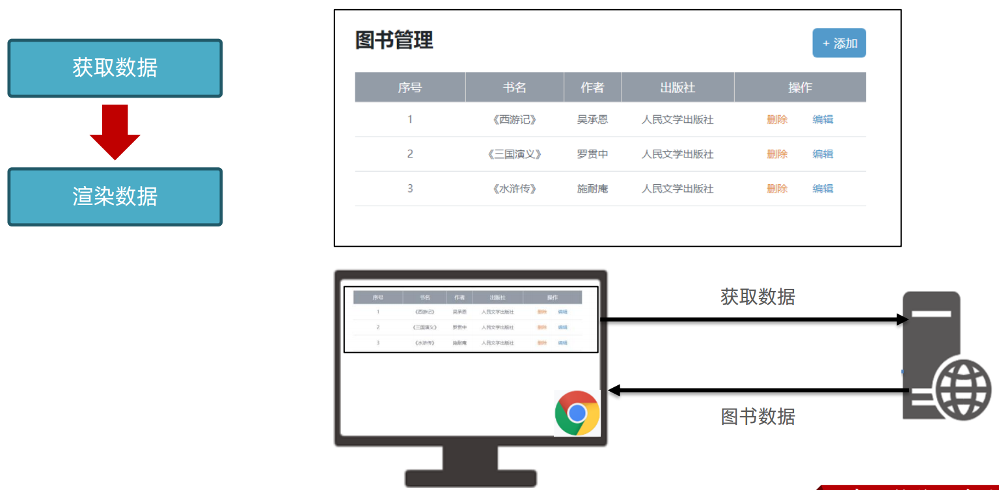

核心步骤 - 渲染数据

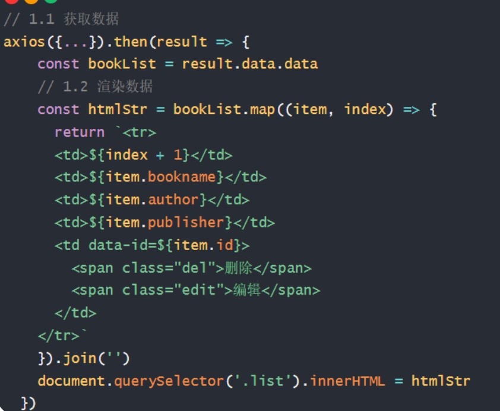


### 1.3 图书管理 - 新增图书


核心步骤 - 新增数据


### 1.4 图书管理 - 删除图书


核心步骤 - 删除数据


### 1.5 图书管理 - 编辑图书


核心步骤 - 编辑数据


## 2. 图片上传


1. 获取图片文件对象
2. 使用 FormData 携带图片文件


3. 提交表单数据到服务器，使用图片 url 网址


## 3. 案例 - 网站换肤


1. 选择图片上传，设置body背景
2. 上传成功时，保存url网址
3. 网页运行后，获取url网址使用


## 4. 案例 - 个人信息设置


步骤：
1. 信息渲染
2. 头像修改
3. 提交表单
4. 结果提示


### 4.1 个人信息设置 - 信息渲染


自己的用户信息：给自己起个<font color='red'>外号</font>，并告诉服务器，获取对应的用户信息


### 4.2 个人信息设置 - 头像修改


### 4.3 个人信息设置 - 信息修改


### 4.4 个人信息设置 - 提示框


# 三、Ajax原理


## 1. XMLHttpRequest


**定义：**


**关系：**axios 内部采用 XMLHttpRequest 与服务器交互


**好处：**掌握使用 XHR 与服务器进行数据交互，了解 axios 内部原理

> AJAX 原理是什么？
> XMLHttpRequest 对象


### 1.1 使用 XMLHttpRequest


**步骤：**

1. 创建 XMLHttpRequest 对象
2. 配置<font color='red'>请求方法</font>和请求 <font color='red'>url </font>地址
3. 监听 loadend 事件，接收<font color='red'>响应结果</font>
4. 发起请求


**示例：**获取并展示所有省份名字


### 1.2 XMLHttpRequest - 查询参数


**定义：**浏览器提供给服务器的<font color='red'>额外信息</font>，让服务器返回浏览器想要的数据

**语法：**http://xxxx.com/xxx/xxx<font color='red'>?</font>font>参数名1=值1<font color='red'>&</font>参数名2=值2


**示例：**地区查询


需求：输入省份和城市名字，查询地区列表

请求地址：http://hmajax.itheima.net/api/area?参数名1=值1&参数名2=值2


### 1.3 XMLHttpRequest - 数据提交


**需求：**通过 XHR 提交用户名和密码，完成注册功能

**核心：**

<font color='red'>请求头</font>设置 Content-Type：application/json

<font color='red'>请求体</font>携带 JSON 字符串


​	

## 2. Promise


**定义：**


**好处：**

1. 逻辑更清晰，成功和失败状态，可以关联对应处理程序
2. 了解 axios 函数内部运作机制
3. 能解决回调函数地狱问题


**语法：**


### 2.1 Promise - 三种状态


**作用：**了解Promise对象如何<font color='red'>关联</font>的<font color='red'>处理函数</font>，以及代码执行顺序

**概念：**一个Promise对象，必然处于以下几种状态之一

✓ 待定（pending） ：初始状态，既没有被兑现，也没有被拒绝
✓ 已兑现（fulfilled） ：意味着，操作成功完成
✓ 已拒绝（rejected） ：意味着，操作失败


> [!CAUTION]
>
> 注意：Promise对象一旦被<font color='red'>兑现/拒绝</font>就是<font color='red'>已敲定</font>了，状态无法再被改变


**示例：**使用Promise + XHR 获取省份列表

**需求：**使用 Promise 管理 XHR 获取省份列表，并展示到页面上

**步骤：**

1. 创建 Promise 对象
2. 执行 XHR 异步代码，获取省份列表
3. 关联成功或失败函数，做后续处理


## 3. 封装简易版 axios


### 3.1 获取省份列表


需求：基于 Promise + XHR 封装 myAxios 函数，获取省份列表展示

步骤：

1. 定义 myAxios 函数，接收<font color='red'>配置对象</font>，返回 <font color='red'>Promise 对象</font>
2. 发起 <font color='red'>XHR 请求，默认请求方法</font>为 GET
3. 调用成功/失败的处理
4. 使用 myAxios 函数，获取省份列表展示


### 3.2 获取地区列表


需求：修改 myAxios 函数支持传递<font color='red'>查询参数</font>，获取"辽宁省"，"大连市"对应地区列表展示

步骤：

1. myAxios 函数调用后，判断 <font color='red'>params </font>选项
2. 基于 URLSearchParams 转换<font color='red'>查询参数字符串</font>
3. 使用自己封装的 myAxios 函数展示地区列表


### 3.3 注册用户


需求：修改 myAxios 函数支持传递<font color='red'>请求体</font>数据，完成注册用户功能

步骤：

1. myAxios 函数调用后，判断 <font color='red'>data </font>选项
2. 转换数据类型，在<font color='red'> send 方法</font>中发送
3. 使用自己封装的 myAxios 函数完成注册用户功能


## 4. 案例 - 天气预报


步骤：
1. 获取北京市天气数据，展示
2. 搜索城市列表，展示
3. 点击城市，显示对应天气数据


### 4.1 搜索城市列表


需求：根据关键字，展示匹配城市列表

步骤：

1. 绑定 input 事件，获取关键字
2. 获取展示城市列表数据


### 4.2 展示城市天气


需求：展示用户搜索查看的城市天气

步骤：

1. 检测搜索列表点击事件，获取城市 code 值
2. 复用获取展示城市天气函数


# 四、Ajax进阶


## 1. 同步代码和异步代码


### 1.1 同步代码和异步代码


同步代码：[异步 JavaScript 简介 - 学习 Web 开发 | MDN](https://developer.mozilla.org/zh-CN/docs/Learn_web_development/Extensions/Async_JS/Introducing#同步编程)


异步代码：[异步 JavaScript 简介 - 学习 Web 开发 | MDN](https://developer.mozilla.org/zh-CN/docs/Learn_web_development/Extensions/Async_JS/Introducing)


同步代码：逐行执行，需<font color='red'>原地等待结果</font>后，才继续向下执行

异步代码：调用后<font color='red'>耗时</font>，不阻塞代码继续执行（不必原地等待），在将来完成后触发一个<font color='red'>回调函数</font>


> [!NOTE]
>
> JS 中有哪些异步代码？
>
> ➢ setTimeout / setInterval
> ➢ 事件
> ➢ AJAX
>
> 
>
> 异步代码如何接收结果？
>
> ➢ 依靠<font color='red'>回调函数</font>来接收


### 1.2 同步和异步


例子：回答打印数字的顺序是什么？


打印结果：1,4,2
点击按钮一次就打印一次 3

异步代码接收结果：使用<font color='red'>回调函数</font>


## 2. 回调函数地狱和 Promise 链式调用


### 2.1 回调函数地狱

需求：展示默认第一个省，第一个城市，第一个地区在下拉菜单中

概念：在回调函数中<font color='red'>嵌套回调函数</font>，一直嵌套下去就形成了回调函数地狱

缺点：可读性差，异常无法捕获，耦合性严重，牵一发动全身


### 2.2 Promise - 链式调用


概念：依靠 then() 方法会返回一个<font color='red'>新生成的 Promise 对象</font>特性，继续串联下一环任务，直到结束

细节：then() 回调函数中的<font color='red'>返回值</font>，会影响新生成的 Promise 对象<font color='red'>最终状态和结果</font>

好处：通过链式调用，解决回调函数嵌套问题


**Promise 链式应用**

目标：使用 Promise 链式调用，解决回调函数地狱问题

做法：每个 Promise 对象中管理一个异步任务，用 then 返回 Promise 对象，串联起来


## 3. async 和 await 使用


### 3.1 async函数和await


定义：[async function - JavaScript | MDN](https://developer.mozilla.org/zh-CN/docs/Web/JavaScript/Reference/Statements/async_function)


概念： 在 async 函数内，使用 await 关键字取代 then 函数，<font color='red'>等待</font>获取 Promise 对象<font color='red'>成功状态的结果值</font>

示例：


### 3.2 async函数和await_捕获错误


使用：


语法：


## 4. 事件循环-EventLoop


### 4.1 认识 - 事件循环（EventLoop）


好处：掌握 JavaScript 是如何安排和<font color='red'>运行代码</font>的


**事件循环（EventLoop）**


概念：


原因：JavaScript 单线程（某一刻只能执行一行代码），为了让耗时代码不阻塞其他代码运行，设计了<font color='red'>事件循环模型</font>


### 4.2 事件循环 - 执行过程


定义：执行代码和收集异步任务的模型，在调用栈空闲，反复调用任务队列里回调函数的执行机制，就叫事件循环


JavaScript 内代码如何执行？

- 执行同步代码，遇到<font color='red'>异步代码</font>交给<font color='red'>宿主</font>浏览器环境执行
- 异步有了结果后，把回调函数放入<font color='red'>任务队列排队</font>
- 当调用栈<font color='red'>空闲</font>后，反复调用任务队列里的回调函数


### 4.3 宏任务与微任务


ES6 之后引入了 Promise 对象， 让 JS 引擎也可以发起异步任务

异步任务分为：

- <font color='red'>宏任务</font>：由<font color='red'>浏览器</font>环境执行的异步代码
- <font color='red'>微任务</font>：由<font color='red'>JS 引擎</font>环境执行的异步代码


> [!CAUTION]
>
> Promise 本身是同步的，而then和catch<font color='red'>回调函数</font>是异步的


**宏任务与微任务 - 执行顺序**


JavaScript 内代码如何执行？

- 执行第一个 script 脚本事件宏任务，里面<font color='red'>同步</font>代码
- 遇到 <font color='red'>宏任务/微任务</font> 交给宿主环境，有结果回调函数进入对应队列
- 当执行栈空闲时，<font color='red'>清空微任务</font>队列，再执行<font color='red'>下一个宏任务</font>，从1再来


## 5. Promise.all 静态方法


### 5.1 Promise.all 静态方法


**概念：**合并多个 Promise 对象，等待所有<font color='red'>同时成功</font>完成（或某一个失败），做后续逻辑


**语法：**


**需求**：同时请求“北京”，“上海”，“广州”，“深圳”的天气并在网页尽可能<font color='red'>同时</font>显示


## 6. 案例 - 商品分类


需求：尽可能同时展示所有商品分类到页面上

步骤：

1. 获取所有的一级分类数据
2. 遍历id，创建获取二级分类请求
3. 合并所有二级分类Promise对象
4. 等待同时成功，开始渲染页面


## 7. 案例 - 学习反馈


### 7.1 学习反馈 - 省市区切换


需求：完成省市区切换效果

步骤：

1. 设置<font color='red'>省份数据</font>到下拉菜单
2. 切换省份，设置<font color='red'>城市数据</font>到下拉菜单，并清空地区下拉菜单
3. 切换城市，设置<font color='red'>地区数据</font>到下拉菜单


### 7.2 学习反馈 - 数据提交


需求：收集学习反馈数据，提交保存
步骤：
1. 监听提交按钮的<font color='red'>点击事件</font>
2. 依靠插件<font color='red'>收集</font>表单数据
3. 基于 axios 提交<font color='red'>保存</font>，显示结果


