# Node.js 入门

> JavaScript 运行时环境

## 1. Node.js 简介

**定义：**[Node.js - MDN Web 文档术语表：Web 相关术语的定义 | MDN](https://developer.mozilla.org/zh-CN/docs/Glossary/Node.js)

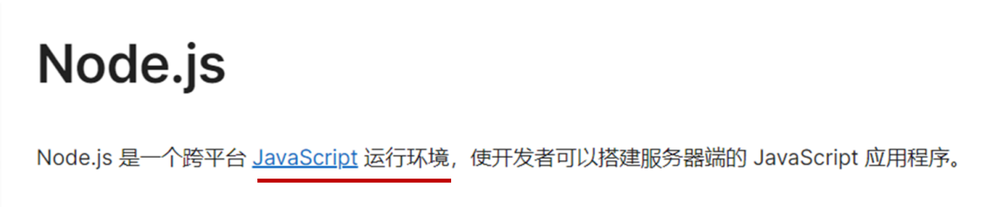

**作用：**使用 Node.js 编写服务器端程序

- 编写数据接口，提供网页资源浏览功能等等
- 前端工程化：为后续学习 Vue 和 React 等框架做铺垫

> [!CAUTION]
>
> Node.js 是什么？
> ➢ 基于 Chrome 的 V8 引擎封装，独立执行 JavaScript 代码的环境

## 2. 什么是前端工程化？

**前端工程化：**开发项目直到上线，过程中集成的所有工具和技术

Node.js 是前端工程化的基础（因为 Node.js 可以主动读取前端代码内容）

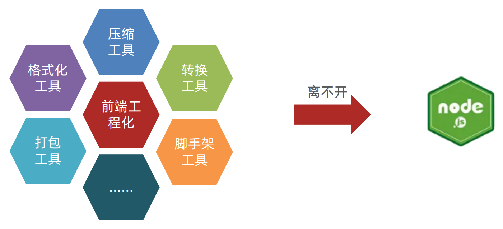

## 3. Node.js 为何能执行 JS？

**首先：**浏览器能执行 JS 代码，依靠的是内核中的 V8 引擎（C++ 程序）

**其次：**Node.js 是基于 Chrome V8 引擎进行封装（运行环境）

**区别：**都支持 ECMAScript 标准语法，Node.js 有独立的 API

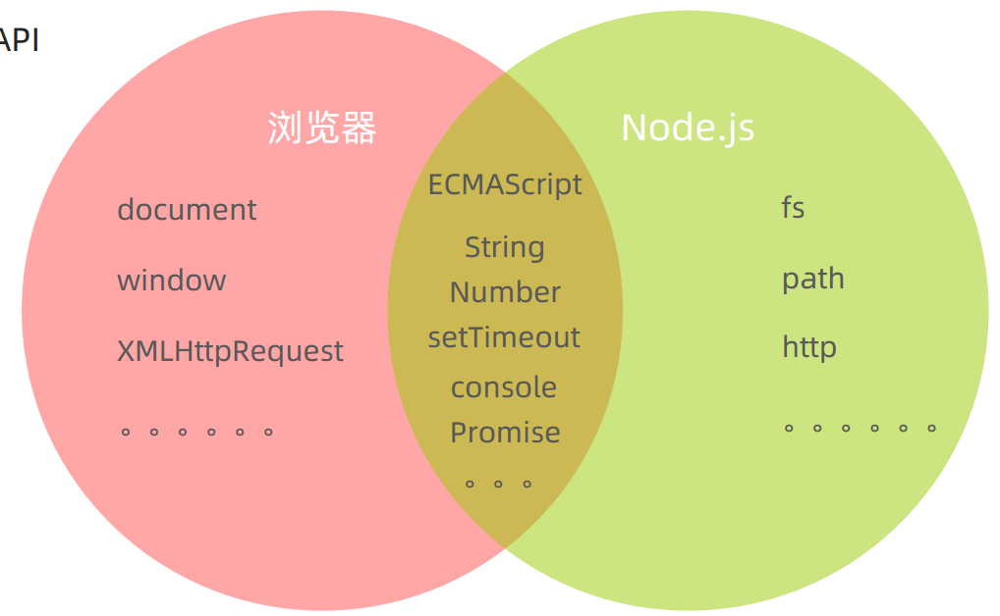

**注意：**Node.js 环境没有 DOM 和 BOM 等

> [!CAUTION]
>
> Node.js 与浏览器环境的 JS 最大区别？
> ➢ Node.js 环境中没有 BOM 和 DOM

## 4. Node.js 安装

**要求：**下载 node-v16.19.0.msi 安装程序（指定版本：兼容 vue-admin-template 模板）

**安装过程：**默认下一步即可

**注释事项：**

1. 安装在非中文路径下
2. 无需勾选自动安装其他配套软件

**成功验证：**

1. 打开 cmd 终端，输入 node -v 命令查看版本号
2. 如果有显示，则代表安装成功

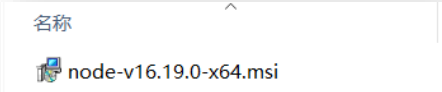

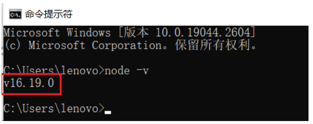

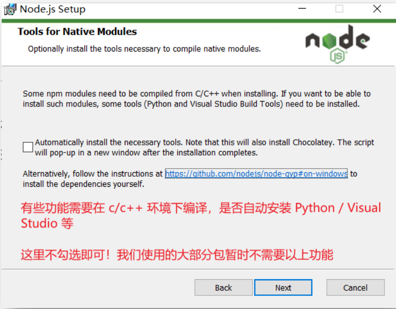

## 5. 使用 Node.js

**需求：**新建 JS 文件，并编写代码后，在 node 环境下执行

**命令：**在 VSCode 集成终端中，输入 node xxx.js，回车即可执行

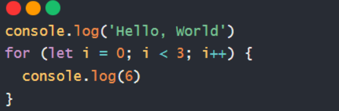

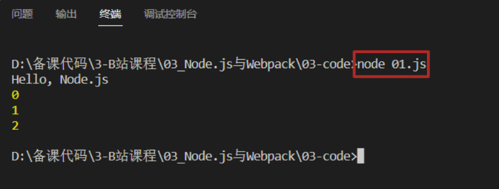

## 6. fs 模块 - 读写文件

**模块：**类似插件，封装了方法/属性

**fs 模块：**封装了与本机文件系统进行交互的，方法/属性

**语法：**

1. 加载 fs 模块对象

2. 写入文件内容

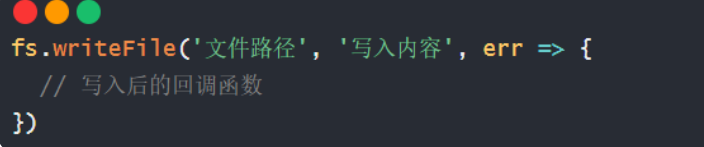

3. 读取文件内容

可以使用 data.toString() 方法将 data 数据内容转换成字符串

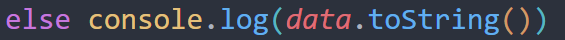

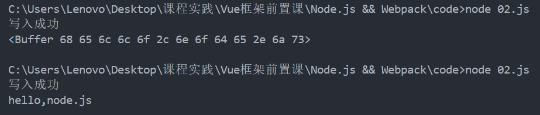

## 7. path 模块 - 路径处理

**问题：**Node.js 代码中，相对路径是根据终端所在路径来查找的，可能无法找到你想要的文件

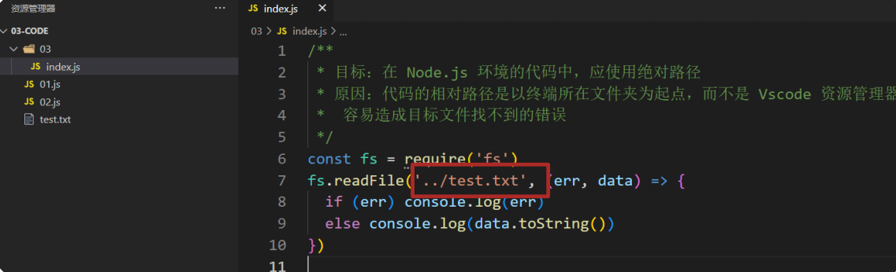

**建议：**在 Node.js 代码中，使用绝对路径

**补充：**__dirname 内置变量（获取当前模块目录-绝对路径）

- windows： D:\备课代码\3-B站课程\03_Node.js与Webpack\03-code\03 
- mac： /Users/xxx/Desktop/备课代码/3-B站课程/03_Node.js与Webpack/03-code/03

**注意：**path.join() 会使用特定于平台的分隔符，作为定界符，将所有给定的路径片段连接在一起

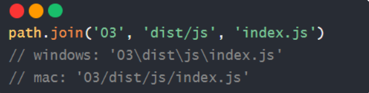

**语法：**

1. 加载 path 模块

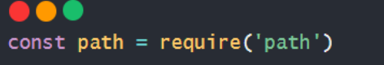

2. 使用 path.join 方法，拼接路径

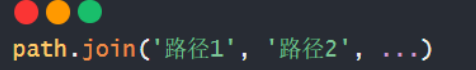

## 8. 案例 - 压缩前端 html

**需求：**把 回车符（\r）和换行符（\n）去掉后，写入到新 html 文件中

**步骤：**

1. 读取源 html 文件内容
2. 正则替换字符串
3. 写入到新的 html 文件中

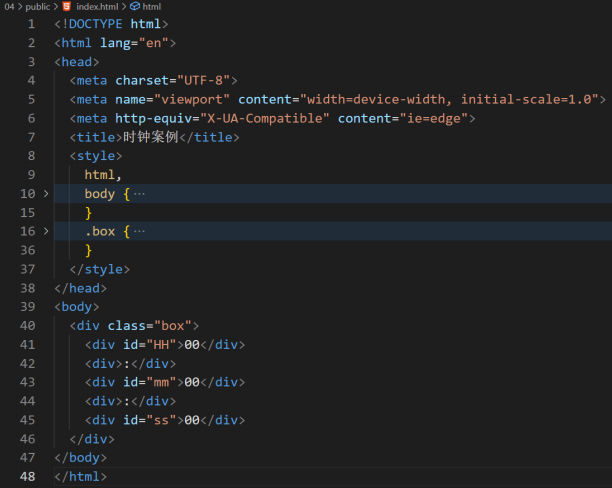

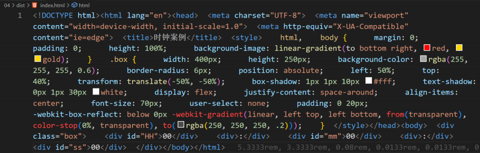

## 9. URL 中的端口号

**URL：**统一资源定位符，简称网址，用于访问服务器里的资源

**端口号：**标记服务器里不同功能的服务程序

**端口号范围：**0-65535 之间的任意整数

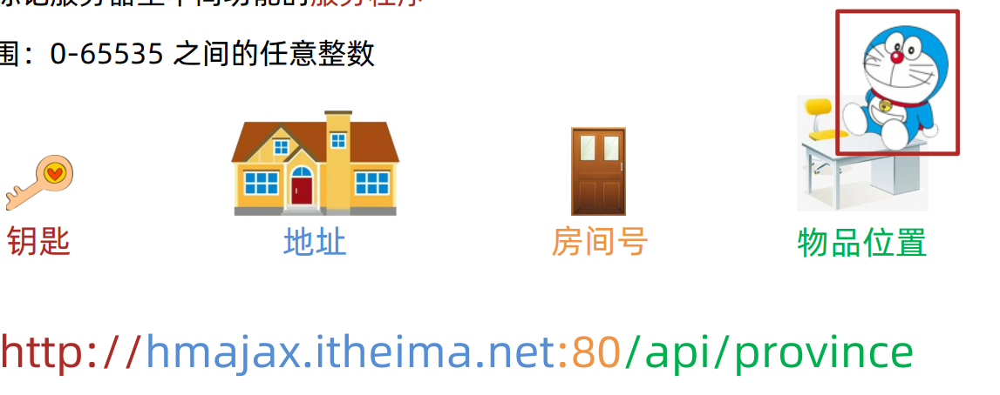

**注意：**http 协议，默认访问 80 端口

## 10. 常见的服务程序

Web 服务程序：用于提供网上信息浏览功能

注意：0-1023 和一些特定端口号被占用，我们自己编写服务程序请避开使用

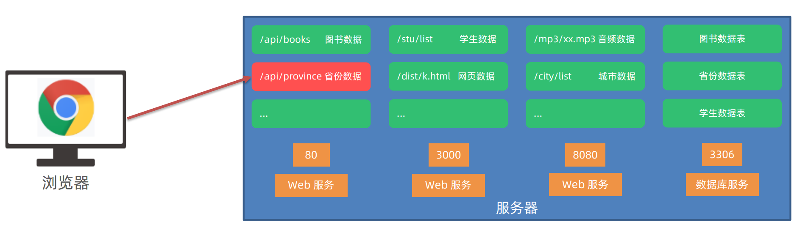

## 11. http 模块-创建 Web 服务

**需求：**创建 Web 服务并响应内容给浏览器

**步骤：**

1. 加载 http 模块，创建 Web 服务对象
2. 监听 request 请求事件，设置响应头和响应体
3. 配置端口号并启动 Web 服务
4. 浏览器请求 http://localhost:3000 测试

（localhost：固定代表本机的域名）

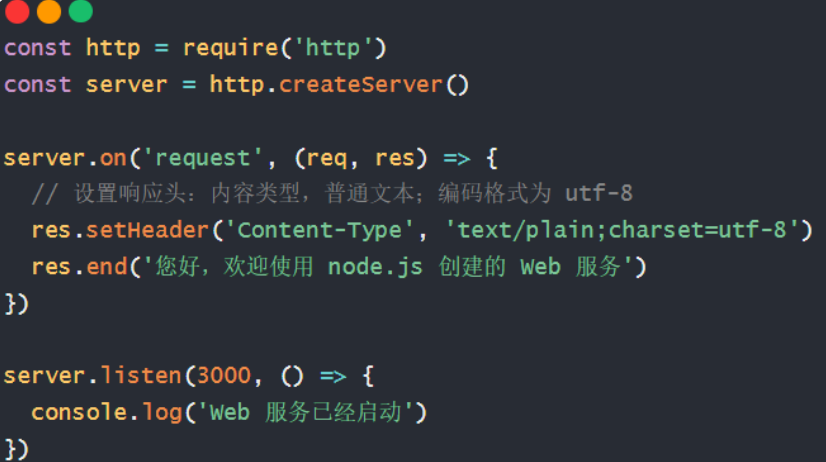

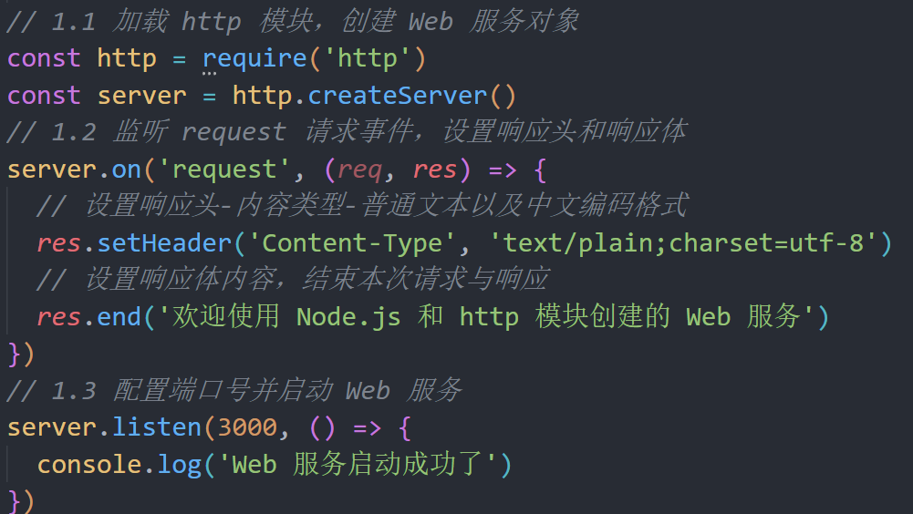

## 12. 案例-浏览时钟

**需求：**基于 Web 服务，开发提供网页资源的功能

**步骤：**

1. 基于 http 模块，创建 Web 服务
2. 使用 req.url 获取请求资源路径，判断并读取 index.html 里字符串内容返回给请求方
3. 其他路径，暂时返回不存在的提示
4. 运行 Web 服务，用浏览器发起请求测试

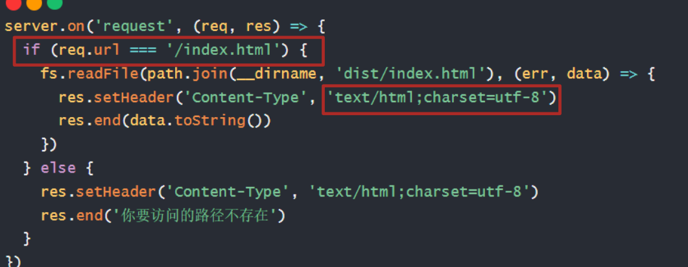

# Node.js 模块化

## 1. 什么是模块化？

**定义：**[CommonJS 模块 | Node.js API 文档](https://nodejs.cn/api-v18/modules.html#modules-commonjs-modules)

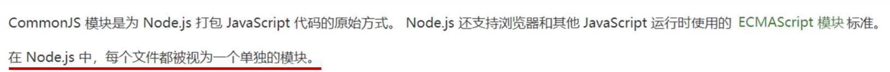

**概念：**项目是由很多个模块文件组成的

**好处：**提高代码复用性，按需加载，独立作用域

**使用：**需要标准语法导出和导入进行使用

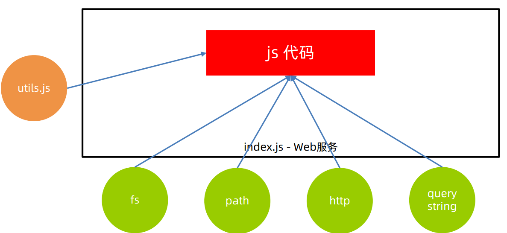

## 2. CommonJS 标准

**需求：**定义 utils.js 模块，封装基地址和求数组总和的函数

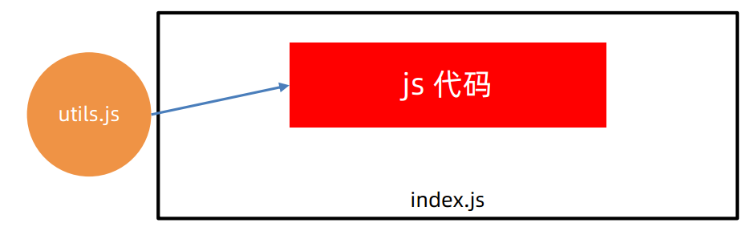

**使用：**

1. **导出：**module.exports = {}
2. **导入：**require('模块名或路径')

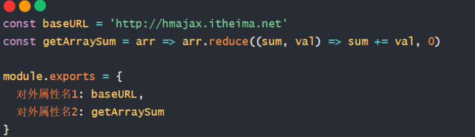

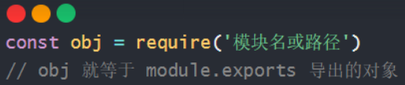

**模块名或路径：**

- 内置模块：直接写名字（例如：fs，path，http）
- 自定义模块：写模块文件路径（例如：./utils.js）

## 3. ECMAScript 标准 

### 3.1 默认导出和导入

**需求：**封装并导出基地址和求数组元素和的函数

**默认标准使用：**

1. 导出：export default {}
2. 导入：import 变量名 from '模块名或路径

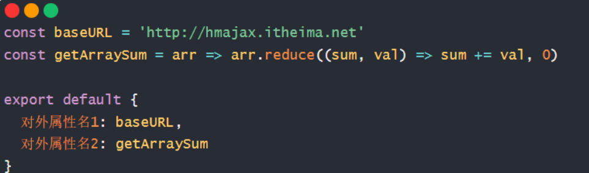

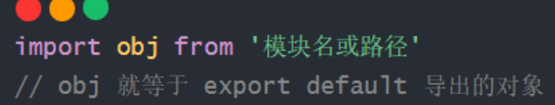

注意：Node.js 默认支持 CommonJS 标准语法

如需使用 ECMAScript 标准语法，在运行模块所在文件夹新建 package.json 文件，并设置 { "type" : "module" }

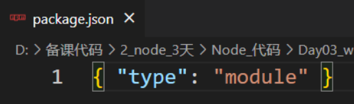

### 3.2 命名导出和导入

**需求：**封装并导出基地址和求数组元素和的函数

**命名标准使用：**

1. 导出：export 修饰定义语句
2. 导入：import { 同名变量 } from '模块名或路径‘

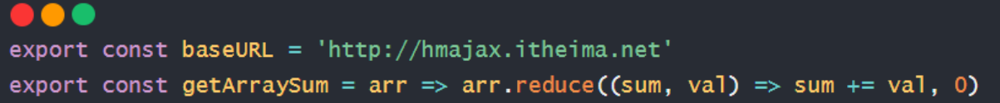

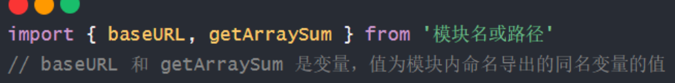

**如何选择：**

- 按需加载，使用命名导出和导入
- 全部加载，使用默认导出和导入

## 4. 包的概念

**包：**将模块，代码，其他资料聚合成一个文件夹

**包分类：**

- 项目包：主要用于编写项目和业务逻辑
- 软件包：封装工具和方法进行使用

**要求：**根目录中，必须有 package.json 文件（记录包的清单信息）

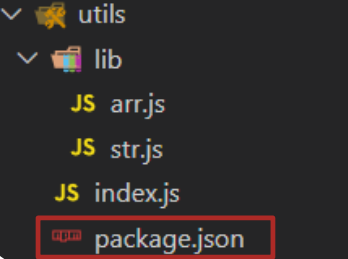

**注意：**导入软件包时，引入的默认是 index.js 模块文件 / main 属性指定的模块文件

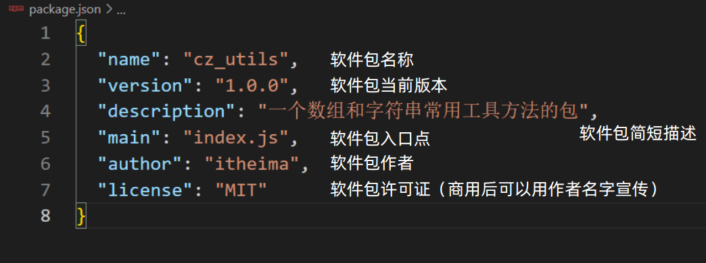

**需求：**封装数组求和函数的模块，判断用户名和密码长度函数的模块，形成成一个软件包

## 5. npm 

### 5.1 软件包管理器

**定义：[Node.js 中文网](https://dev.nodejs.cn/learn/an-introduction-to-the-npm-package-manager#npm-简介)**

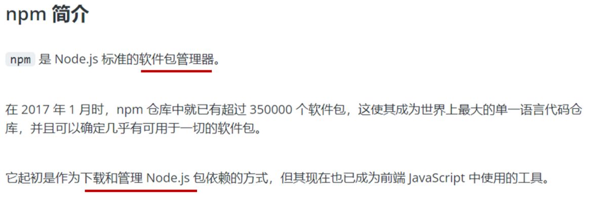

**使用：**

1. 初始化清单文件 ：npm init -y（得到 package.json 文件，有则略过此命令）
2. 下载软件包 ：npm i 软件包名称
3. 使用软件包

**需求：**使用 dayjs 软件包，来格式化日期时间

**图解：**

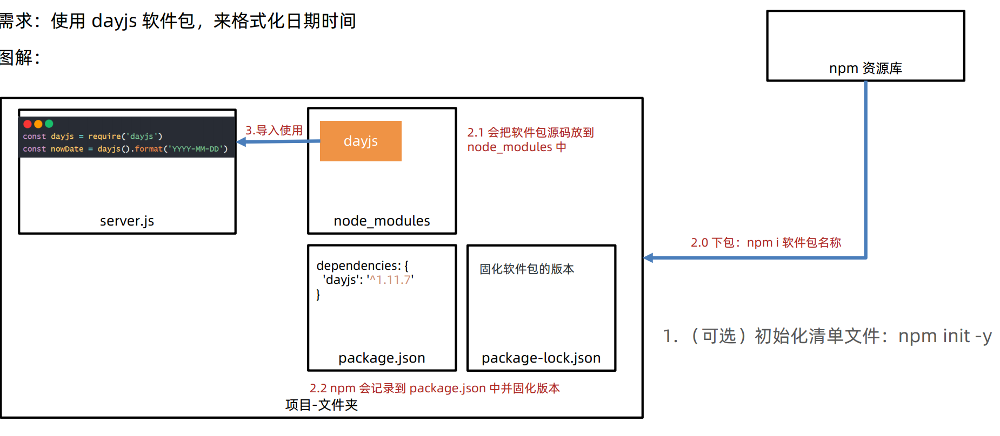

### 5.2 安装所有依赖

**问题：**项目中不包含 node_modules，能否正常运行？

**答案：**不能，缺少依赖的本地软件包

**原因：**因为，自己用 npm 下载依赖比磁盘传递拷贝要快得多

**解决：**项目终端输入命令：npm i

下载 package.json 中记录的所有软件包

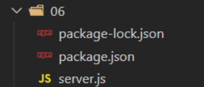

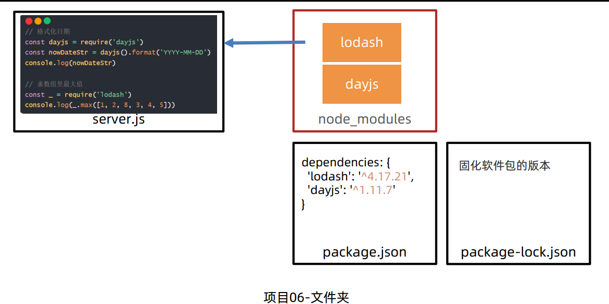

### 5.3 全局软件包 nodemon

**软件包区别：**

- 本地软件包：当前项目内使用，封装属性和方法，存在于 node_modules 
- 全局软件包：本机所有项目使用，封装命令和工具，存在于系统设置的位置

**nodemon 作用：**替代 node 命令，实时检测代码更改，自动重启程序

**使用：**

1. 安装：npm i nodemon -g（-g 代表安装到全局环境中）
2. 运行：nodemon 待执行的目标 js 文件

需求：启动准备好的项目，修改代码保存后，观察自动重启应用程序

# Node.js 总结

**Node.js 模块化：**

概念：每个文件当做一个模块，独立作用域，按需加载

使用：采用特定的标准语法导出和导入进行使用

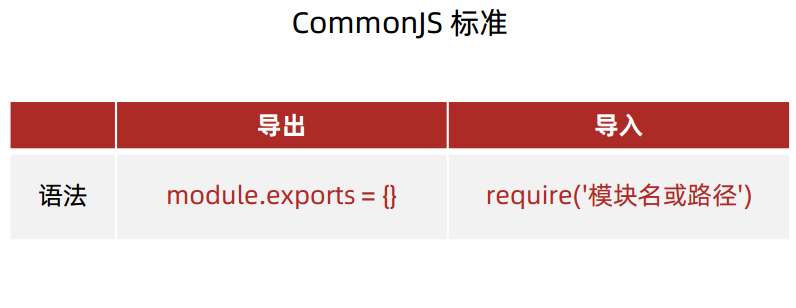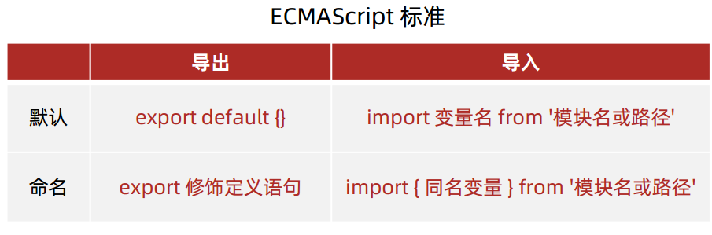

**CommonJS 标准：**一般应用在 Node.js 项目环境中

**ECMAScript 标准：**一般应用在前端工程化项目中

**Node.js 包：**

**概念：**把块文件，代码文件，其他资料聚合成一个文件夹

**项目包：**编写项目需求和业务逻辑的文件夹

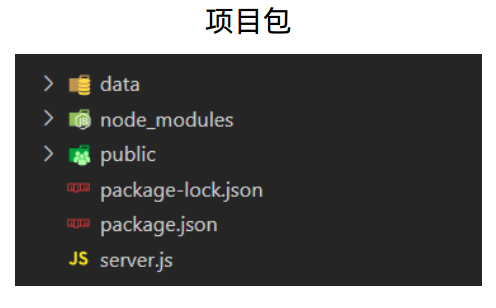

**软件包：**封装工具和方法进行使用的文件夹（一般使用 npm 管理）

- 本地软件包：作用在当前项目，一般封装的属性/方法，供项目调用编写业务需求
- 全局软件包：作用在所有项目，一般封装的命令/工具，支撑项目运行

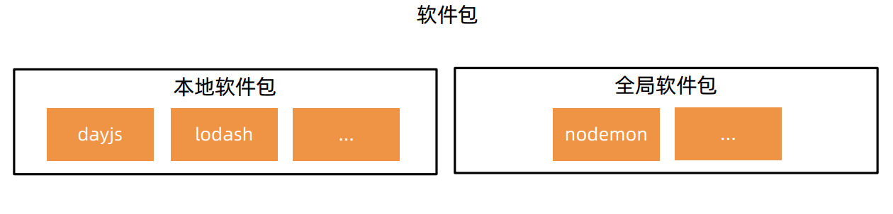

**常用命令：**

|        功能         |                    命令                    |
| :-----------------: | :----------------------------------------: |
|    执行 js 文件     |     node xxx      |
| 初始化 package.json |    npm init -y    |
|   下载本地软件包    |  npm i 软件包名   |
|   下载全局软件包    | npm i 软件包名 -g |
|     删除软件包      | npm uni 软件包名  |

